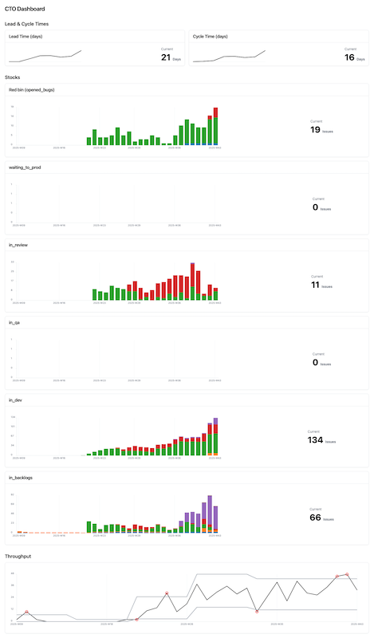

# GitHub Stats (cto-stats)

A minimal toolkit to generate a statistic web dashboard about **the productivity of a software organization**. 

It allows you to see how the organization (the system) is **behaving** and help to identify **bottlenecks** in the **system**.

The generated KPI are : 
 - **Lead time** and **cycle time** trend
 - **Stocks** per week : **Red Bin** for bug and **stocks** per **development process steps**.
 - **Statistics controlled** weekly **throughput** (issues closed per week)

Current sources are :
 - github issues of a github organization.
 - github projects of a github organization.


The tools is a CLI with three subcommands :
  - **import**: fetches issues and timelines from GitHub and writes raw CSVs to ./data - that you can reuse apart if you want to.
  - **calculate**: computes aggregates (cycle time, throughput, WIP stocks) and writes CSVs to ./data  - that you can reuse apart if you want to.
  - **web**: launch web dashboard.

[View full size image](docs/screen-v0.1.png)



## How to run - user mode

### Prequisites

Environment variables:
- GITHUB_TOKEN: a GitHub token with read access to the organization

## Usage

_to be completed_

## How to run - developer mode

### Prequisites

Environment variables:
- GITHUB_TOKEN: a GitHub token with read access to the organization

### Build

```bash
cd ui
pnpm install
pnpm build
```

### Usage

#### 1st step is to import data :

Minimal command :
```bash
go run . import -org your-org 
```

You can restrict the import to a specific date range and/or a list of repositories :
```bash
go run . import -org your-org -since 2025-01-01 -repo repoA,repoB
```

#### 2nd step si to calculate KPI :

```bash
go run . calculate
```

As a bonus, it generated a consolidated CSV file in ./data/calculated_issue.csv that you can reuse if you want to.

### 3rd step is to show up the web dashboard :

Minimal commad is

```bash
go run . web
```

Web dashboard is available at http://localhost:8080/

You can also specify the port, the data folder and the UI folder :
```bash
go run . web -addr :8080 -data ./data -ui ./ui/dist
```

### Dev mode

```bash
cd ui
pnpm run dev
```

Dev Dashboard is now available at http://localhost:5173/

### Extra Documentations

Available API endpoints :
- GET /api/cycle_times → data/cycle_time.csv
- GET /api/stocks → data/stocks.csv
- GET /api/stocks/week → data/stocks_week.csv
- GET /api/throughput/week → data/throughput_week.csv